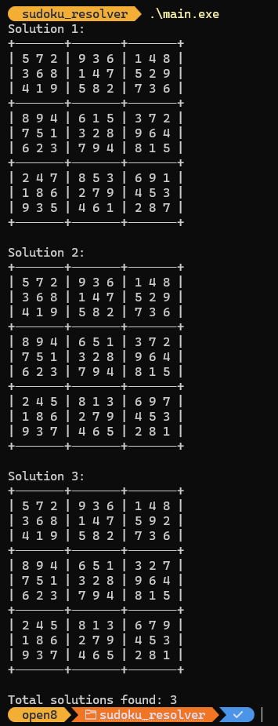

# Sudoku Solver
## 專案開發動機
其實這就是一個簡易的程序 甚至完全說不是是專案

是說我為啥沒事做這個呢，那先得說說前陣子去哪了

為啥 GitHub都沒更新 也都沒有 Git 紀錄呢

沒錯 因為我去當兵惹(心酸) 其實真的偏焦慮阿 
* 會不會出來就被社會淘汰 ( AI進展真的太快了 )
* 軍營裡面智障會不會很多
* 我會不會沒朋友、會不會被欺負
* 訓練操演會不會很累 我無法負擔
* 跑步、游泳那些怎麼辦

不過最後雖然過程有許多蠻靠北的部分，但其實沒有那麼累啦~~~

對了我抽中的是海軍歐 ( 四個月兵 然後沒下部隊 )

> ### 想像中的海軍模樣


> ### 實際的海軍模樣


其實真的蠻廢的 基本第二階段後 

就是教官在上面講課 我們在下面睡覺、讀自己的書與玩數獨

```text
備註 :
    在裡面真的很無聊，不過多虧這麼多無聊時間
    讀了許多論文與書籍，未來有空可以來整理並分享

    算是把原本很缺乏的理論知識好好的補課一番
    蠻多關於分散式、資料庫、資料結構、系統設計等等
    認為蠻多的很有意思的，順便練習英文
```

## 解數獨

沒錯終於來到我們的主角"數獨"

那天主要是我的同梯 "添銘" 和 "玉霖"，我們在玩數獨

後來 "添銘" 說，有天他有解出一題與答案不一樣，但覺得是對的

我們就去檢查了莫，因為邏輯上，一個數獨不可能有兩個答案

如果存在的話那就是個爛題目（沒有啦，哈哈哈）

而且通常這種狀況都是哪個地方眼花了填錯了之類的

但那天我們檢查了超久，真心感覺是對了

後來我就想說，下午與其來睡覺耍廢，不如寫個程式來解數獨吧

當然軍中不可能給你帶電腦進去，所以我就用紙筆來寫

開始手搓程式碼，其實稍微有點熟悉度來是做得到啦

寫了一下後，放假後就把它打出來

結果發現該題甚至不只兩種解答，而是有三種 !!!

天啊，這個賣數獨的怎麼給這樣的題目阿！

```text
添銘 :
    他都會看 "富爸爸" 但我都說他在看 "當爸爸"
    可能他真的想當爸爸吧
    然後他長得真的蠻帥的 很有型
玉霖 :
    他是牙醫，但我覺得他可以轉行當殺手
    打靶手超穩的，不愧是經過專業訓練的
    同時他是我的九天好夥伴
```
## 程序執行
### 那驚人的題目
```text
數獨題目 (未知部分我直接使用空白鍵 避免畫面太亂)
+-------+-------+-------+
|   7   |   6   |   4 8 |
|     8 |     7 | 5     |
|       | 5     |     6 |
+-------+-------+-------+
| 8 9   |       | 3     |
| 7     |   2   | 9   4 |
|     3 |       |   1 5 |
+-------+-------+-------+
| 2     |     3 |       |
|     6 | 2     | 4     |
| 9 3   | 4     |     8 |
+-------+-------+-------+
```
### 程序計算結果


## 程序解題思路
程式使用深度優先搜索(DFS)配合回溯法來解題。主要步驟如下:

1. 先將已知數字的位置記錄在 fixedPairs 集合中，這些位置後續不需要嘗試填入數字

2. 從左上角(0,0)開始，依序往右遍歷每個格子:
   - 如果是已知數字(在fixedPairs中)就直接跳到下一格
   - 如果是空格就嘗試填入1-9的數字

3. 每次填入數字前會檢查:
   - 該行是否已存在相同數字
   - 該列是否已存在相同數字  
   - 該3x3方格內是否已存在相同數字

4. 如果某個數字符合規則就:
   - 將該數字填入格子
   - 遞迴處理下一個位置
   - 如果遞迴失敗就回溯(將該格重設為-1)並嘗試下一個數字

5. 當遞迴到最後一格(row=9)時代表找到一組解，印出並繼續找下一組解

> 這種窮舉法雖然簡單但效率不高，好處是能找出所有可能的解答。
